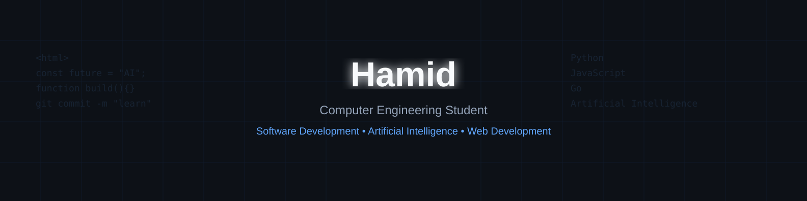

  

---

## 👨‍💻 About Me

- 🎓 Computer Engineering Student
- 💻 Passionate about Software Development
- 🌐 Interested in Web Development
- 🤖 Exploring Artificial Intelligence
- 🚀 Learning through building real-world projects

---

## 🛠️ Tech Stack

---

## 🔥 GitHub Streak

---

---

### ⭐ Thanks for visiting my profile!

